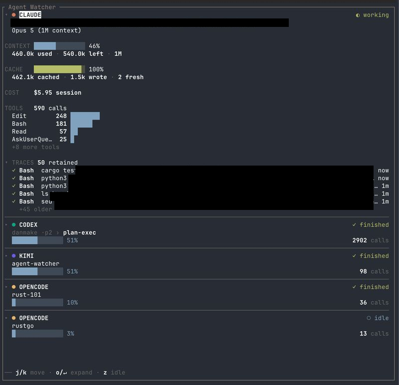

# herdr-agent-watcher

**English** · [简体中文](README.zh-CN.md) · [日本語](README.ja.md)

Coding-agent observability for [Herdr](https://herdr.dev): live sidebar cards, lifecycle
notifications, and a zero-config metrics bridge for Claude Code.



*Five sessions across four agents in one pane — working, finished, idle. The expanded
Claude card also carries CONTEXT, CACHE and COST: numbers Claude Code reports through a
status line and nowhere else, which is what the bridge puts there.*

The idea began inside [Vimeflow](https://github.com/winoooops/vimeflow), where watching
coding agents was one layer of a much larger Electron app.

Pairs with [herdr-agent-title-sync](https://github.com/winoooops/herdr-agent-title-sync),
which keeps Herdr pane titles in step with what each agent is doing.

Local observation is the default. The one thing that leaves your machine is Kimi's
plan-usage lookup, which is off until you turn it on — see
[Kimi usage consent](#kimi-usage-consent).

## Install

```sh
herdr plugin install winoooops/herdr-agent-watcher
```

Requires Herdr 0.8.0+. Install fetches a prebuilt binary for macOS and Linux (x86_64 and
arm64) and checks its SHA256. If no asset matches your platform, or anything about the
download fails, it builds from source instead — that path needs Rust 1.88+, which Herdr
reports rather than installs.

Installing into an already-running Herdr server does not start the daemon. Run it once:

```sh
herdr plugin action invoke restart-daemon --plugin herdr-agent-watcher
```

Herdr's own stock UI works without the sidebar: it receives lifecycle notifications and
pane metadata tokens — `agent_watcher_state`, `agent_watcher_phase`, `agent_watcher_model`,
`agent_watcher_context_pct`, `agent_watcher_attention` and `agent_watcher_title`. Those
names are the integration surface with Herdr and are deliberately stable.

## Commands

Every action is invoked the same way:

```sh
herdr plugin action invoke <id> --plugin herdr-agent-watcher
```

Output goes to the plugin log — read the last run with
`herdr plugin log list --plugin herdr-agent-watcher --limit 1`.

| Action | What it does | More |
| --- | --- | --- |
| `restart-daemon` | Start or restart the daemon | |
| `stop-daemon` | Stop the daemon | |
| `open-sidebar` | Open the live sidebar in a new split | [Sidebar](#sidebar) |
| `bind-sidebar-key` | Bind a key to open the sidebar | [Sidebar](#sidebar) |
| `unbind-sidebar-key` | Remove that binding | [Sidebar](#sidebar) |
| `enable-claude-bridge` | Install the metrics bridge into Claude's own settings | [Claude metrics bridge](#claude-metrics-bridge) |
| `disable-claude-bridge` | Restore the settings file to its pre-enable state | [Claude metrics bridge](#claude-metrics-bridge) |
| `doctor` | Say why metrics are missing, and what to do | [Doctor](#doctor) |
| `kimi-consent-on` | Allow Kimi plan-usage lookup | [Kimi usage consent](#kimi-usage-consent) |
| `kimi-consent-off` | Revoke it — takes effect without a restart | [Kimi usage consent](#kimi-usage-consent) |
| `kimi-consent-status` | Show the current setting | [Kimi usage consent](#kimi-usage-consent) |

## Sidebar

```sh
herdr plugin action invoke open-sidebar --plugin herdr-agent-watcher
```

Each invocation intentionally opens another split. No key opens it until you bind one with
the steps below; the default is `prefix+a`, which is `ctrl+b` then `a` with Herdr's own
prefix. Cards show agent state, agent/model, title, context use, cache hit rate, cost, tool
count, and the three newest tool traces.
Use `j`/`k` or PageUp/PageDown to scroll, `o`/`↵` to expand, `z` to hide idle agents,
`x` to open the menu, `?` to list every key, and `q`/`Esc` or Ctrl-C to close.

To open it with a key:

```sh
herdr plugin action invoke bind-sidebar-key --plugin herdr-agent-watcher
```

That writes the binding into **Herdr's** config, refusing if the key is already taken and
naming what holds it. For a different key, set `keys.open_sidebar` before running it.

`x` also offers **Update**, or `u` from any panel: it asks GitHub for the newest release and says how it compares
to the build you are running. It asks only when you open it — nothing here contacts the
network on its own. When a newer release exists and the plugin came from GitHub, `u`
installs it and then asks you to reopen the sidebar, because no process can replace the
binary it is executing. A linked working directory is told to `git pull` instead: herdr
refuses to install over a link, and the tree belongs to whoever is editing it.

> [!WARNING]
> `unbind-sidebar-key` takes the binding back out. Run it **before uninstalling the
> plugin** — Herdr runs nothing on uninstall, so otherwise the binding outlives the action
> it points at.

If the daemon is unavailable when the sidebar opens, the pane says so and waits for a key.
If it disconnects while the sidebar is open — usually the restart the settings panel just
ordered — the cards stay on screen, a notice counts the seconds, and the sidebar resubscribes
on its own; keys keep working the whole time. After a minute without the daemon it stops
trying and waits for a key. Its state socket (`$HERDR_PLUGIN_STATE_DIR/herdr-agent-watcher-state.sock`,
`WIRE_VERSION = 2`) is plugin-internal, not a public API.

Stop the daemon with:

```sh
herdr plugin action invoke stop-daemon --plugin herdr-agent-watcher
```

## Configuration

Most of this is easier from the sidebar: open it, press `x`, and the settings panel edits
the same file live — you see each change on the cards as you make it, and only the keys you
touched are written. Reach for the file directly when you want comments, a key the panel
does not expose, or to check something into version control.

Every key is optional and every bad value falls back to its default, so a mistake costs one
setting rather than the plugin.

| Key | Values | Default | What it does |
| --- | --- | --- | --- |
| `daemon.interval_ms` | positive integer | `1000` | Reconcile interval. Read at startup, so a change needs `restart-daemon`. `AGENT_WATCHER_INTERVAL_MS` outranks it |
| `daemon.prune_after_days` | `7`, `14`, `30`; `0` disables | `7` | Removes session dirs unwritten that long. Startup-only; restart required |
| `appearance.theme` | `inherit`, `lumon` | `inherit` | `inherit` uses your terminal's colours; `lumon` paints its own |
| `appearance.agent_mark` | `dot`, `initial`, `symbol` | `dot` | The agent's mark on a card |
| `cards.auto_expand` | `none`, `all` | `none` | Start cards expanded |
| `cards.tool_calls` | `bars`, `jar` | `bars` | How the context meter is drawn |
| `cards.trace_lines` | `1`–`20` | `5` | Traces per expanded card. Out of range clamps, it does not reject |
| `list.sort` | `position`, `smart`, `group` | `position` | Card order: Herdr's layout, urgency, or grouped by agent. `position` is the default because it is the only one that does not move under you |
| `list.hide_idle` | `true`, `false` | `false` | Hide idle agents, as `z` does |
| `list.scope` | `all`, `workspace` | `all` | `workspace` needs `HERDR_WORKSPACE_ID`; without it, falls back to `all` |
| `keys.open_sidebar` | a Herdr key string | `prefix+a` | The key `bind-sidebar-key` writes. Set it before binding |
| `agent.<id>.color` | `#rrggbb` | built-in | Override an agent's colour |
| `agent.<id>.label` | any string | built-in | Override its name on cards |
| `agent.<id>.symbol` | any string | built-in | Its mark when `agent_mark = "symbol"` |

Settings live in **the plugin's own** `config.toml` — not Herdr's. Herdr ignores tables it
does not recognise, so `[daemon]` placed in `~/.config/herdr/config.toml` does nothing
except make `herdr config check` report an unknown section.

The plugin's config directory is printed by:

```sh
herdr plugin list
```

By default that is `${XDG_CONFIG_HOME:-~/.config}/herdr/plugins/config/herdr-agent-watcher/`.
Create `config.toml` there if it does not exist.

```toml
[daemon]
interval_ms = 5000

[list]
scope = "workspace"
sort  = "position"
```

Each session directory contains only `attention.jsonl` and `status.json`; the scripts live
once at the state root. Removing a quiet directory is safe because the next write recreates
it (`append_attention` creates its parent). A still-running session comes back without
history that nothing was reading.

Run [`doctor`](#doctor) to see whether a setting was rejected and what was used instead.

## Supported agents

| Agent | Where its metrics come from | Bridge | State |
| --- | --- | --- | --- |
| Claude Code (`claude`, `claude-code`) | its status line, only | **required** — one `enable-claude-bridge` | ✅ |
| Codex CLI (`codex`) | rollout transcript | none | ✅ |
| Kimi Code (`kimi`) | transcript, plus an opt-in usage API | none | ✅ |
| OpenCode (`opencode`) | bundled bridge plugin | installed for you on first bind | ✅ |

Only Claude needs a bridge you invoke, and only because no hook event it emits carries
usage data — its status line is the single channel. OpenCode's bridge is a plugin this one
installs on your behalf; Codex and Kimi need nothing.

To add an agent, implement `AgentAdapter` under `src/agents/` and register it with
`AgentRegistry` in `src/daemon/run.rs`. Agent-specific parsing belongs in the adapter;
Herdr socket details stay behind `HerdrPort`.

## Claude metrics bridge

Claude Code reports CONTEXT, CACHE and COST only through its status line, so it needs a
bridge the other three agents do not.

```sh
herdr plugin action invoke enable-claude-bridge --plugin herdr-agent-watcher
```

That edits Claude's own user settings — it prints which file — and chains your existing
status line behind the bridge so it still runs. No `PATH`, no new shell: every Claude is
bridged in every pane, including sessions already running, which pick it up on their next
status-line render.

```sh
herdr plugin action invoke disable-claude-bridge --plugin herdr-agent-watcher
```

restores the file, removing the `statusLine` entirely if you had none. A status line you
changed after enabling is left alone — the bridge takes back only what is still its own.

## Doctor

The same report is a keypress away inside the sidebar: `x`, then the doctor row. `r`
rebuilds it. Run it from the shell when you want it outside a Herdr pane, or in a script.

Run it when a card reads `— bridge not connected (README)`, or any time metrics are
missing and you want to know why.

```sh
herdr plugin action invoke doctor --plugin herdr-agent-watcher
herdr plugin log list --plugin herdr-agent-watcher --limit 1
```

Doctor names the cause and prints the fix. The one case it cannot fix for you is a project
with its own `statusLine`, which outranks the user tier — it emits a block to paste into
that project's `.claude/settings.local.json`, keeping both the project's status line and
your metrics.

It never reports green on an incomplete picture: managed settings are not discoverable
from here, so if every check passes and metrics are still missing, it says exactly that.

## Troubleshooting

**A Claude card shows `—` for CONTEXT, CACHE and COST.** Those three arrive only through the
status line. Run [`doctor`](#doctor) — it distinguishes the three causes and prints the fix
for each:

- *the bridge is not enabled* — `enable-claude-bridge`;
- *herdr reports no agent session for this pane* — the session in it was replaced, and a
  status line whose session no longer matches the binding is refused. Close and reopen the
  pane;
- *no metrics yet* — nothing is wrong; the pane has not rendered a status line since you
  enabled the bridge. Send it a prompt.

A session that has delegated to a subagent is a fourth, temporary case: the status line then
describes the subagent, so the card shows its model and its usage starts at zero. That one
resolves itself on the main session's next turn.

**A pane has no card at all.** Herdr reports no `agent_session` for a pane that was open
before the daemon started, so it cannot be bound. Close and reopen the pane.

**A setting changed nothing.** `[daemon]` and `[list]` belong to **the plugin's**
`config.toml`, not Herdr's — [`doctor`](#doctor) names them and prints the move if they are
in the wrong one. Open the right file directly with:

```sh
$EDITOR "$(herdr plugin config-dir herdr-agent-watcher)/config.toml"
```

`[list]` is read when a sidebar opens, so an already-open one keeps the settings it started
with. Close it and open it again.

**`doctor` passes every check and metrics are still missing.** It says exactly that rather
than reporting green: managed settings, workspace trust and launch flags are not visible
from here, and any of them can outrank a status line.

## Kimi usage consent

Kimi plan-usage lookup sends the configured API key to its `/usages` endpoint, so it stays
disabled until explicitly enabled. Use the Herdr plugin actions `kimi-consent-on`,
`kimi-consent-off`, and `kimi-consent-status`; revocation is picked up by the running
daemon without a restart.

## OpenCode bridge

The first OpenCode bind installs or updates the bundled bridge in OpenCode's plugin
directory. `AGENT_WATCHER_OPENCODE_PLUGINS_DIR` and `AGENT_WATCHER_OPENCODE_BRIDGE_DIR`
override the install and event directories. The bridge plugin keeps its
`agent-watcher-opencode-bridge` filename: it lives in the ported sidecar tree, which is
frozen.

## Local development

```sh
cargo build --release
herdr plugin link "$PWD"
herdr plugin action invoke restart-daemon --plugin herdr-agent-watcher
```

`plugin link` skips the build step by design; build the working directory yourself.

[`DESIGN.md`](DESIGN.md) records why the plugin is shaped this way.

## Verify

From a source checkout, on the build above.

Scan every supported live agent pane without exposing pane or session IDs:

```sh
./tests/verify-live-agents.sh
./tests/verify-sidebar-state.sh
```

Tier A runs against the deterministic fake Herdr socket and is always enabled:

```sh
cargo test --test e2e_fake_herdr
```

Tier B starts the installed Herdr binary with isolated HOME/XDG directories and is ignored
by default:

```sh
cargo test --test e2e_real_herdr -- --ignored
```

Run all regular tests with `cargo test`.

## Known limitations

- **A pane that was open before the daemon started has no card.** Herdr reports no
  `agent_session` for it, so it cannot be bound. Close and reopen the pane.
- **A pane moved between workspaces keeps its retired id.** A process's pane id is fixed
  at exec, so the daemon no longer recognises it. Doctor shows this rather than failing
  silently, but the session has to be recreated.
- **One Herdr session at a time.** The daemon's lock and sockets live in the user-global
  `$HERDR_PLUGIN_STATE_DIR`, so a second Herdr session replaces the first daemon.
- **`attention.jsonl` is unbounded.** Append-only, with a 192KB per-payload cap but no
  total cap and no rotation.
- **A session's first turn may produce no completion notification**, and four of the five
  hook payloads are stored verbatim — so the guarantee is "the prompt is not persisted",
  not "no user text is persisted". Both live in the frozen `src/agent/**` tree.

## Future work

- [x] Read settings from the plugin's own `config.toml` instead of
      `AGENT_WATCHER_INTERVAL_MS`, so configuration no longer depends on which environment
      the Herdr server was launched from
- [x] Reap bridge session directories by mtime. This is safe because a removed directory
      is recreated on the next write; liveness tracking was only proposed to avoid deleting
      state that could not regenerate
- [ ] Fix resumed Kimi sessions flickering once per reconcile tick. `bind_pane` adds the
      card before binding, then rolls it back when the bind fails. The fallback locator only
      accepts a session created within its 30-second ownership window, while the index path
      also accepts `session_resume_at`; the observed session was created Aug 11 at 02:23 and
      its process started Aug 17 at 06:51. Register the frozen-port change in
      `PORT-SURFACE.md`, and promote the bind failure from `warn!` to `error!` because
      `env_logger` defaults to errors and otherwise hides the cause
- [x] Publish a prebuilt binary per release so `cargo` is not required to install.
      `[[build]]` runs `scripts/fetch-or-build.sh`, which fetches the asset matching the
      platform, verifies its SHA256, and compiles instead on any failure
- [x] Settings and doctor panels in the sidebar, so the common configuration and the
      common diagnosis both happen without leaving the pane
- [x] Survive the daemon restart the settings panel can order: keep the cards up, count the
      seconds, and resubscribe rather than ending at a screen that waits for a key
- [x] Tell a sidebar it is out of date. Upgrading the plugin leaves already-open sidebars
      running the old binary with nothing on screen to say so — it misled us during 0.1.4
      testing. The hello carries the daemon's build and the sidebar pins a notice when it
      is not its own
- [x] A **check / upgrade** row in the menu, asking GitHub only when pressed, off the draw
      loop, and refusing to offer an upgrade a linked tree cannot install
- [ ] Remedies you can act on from the doctor panel — copy to clipboard on `↵` rather than
      running anything, since the fixes edit files outside this plugin
- [x] Fix the flaky `pane_without_cwd_uses_herdrs_cwd_for_that_pane` test. The fake Herdr
      dropped any request whose bytes had not arrived by the instant it accepted, because
      an accepted socket inherits `O_NONBLOCK` on BSD and macOS
